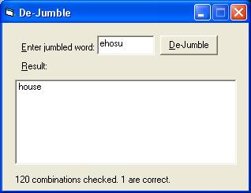



## Dejumble

### Description

Checks all the combinations of the jumbled word and lists correct words. It is a little bit slow. Delete lines which reset caption(i.e. 'Caption =...') to make the program fast.
 
### More Info
 
Jumbled word

It uses dictionary of microsoft offfice. So, Microsoft office should be installed.

             |
---                |---
**Submitted On**   |2000-11-16 05:00:34
**By**             |[Abhinav Soni](https://github.com/Planet-Source-Code/PSCIndex/blob/master/ByAuthor/abhinav-soni.md)
**Level**          |Intermediate
**User Rating**    |5.0 (15 globes from 3 users)
**Compatibility**  |VB 6\.0
**Category**       |[Miscellaneous](https://github.com/Planet-Source-Code/PSCIndex/blob/master/ByCategory/miscellaneous__1-1.md)
**World**          |[Visual Basic](https://github.com/Planet-Source-Code/PSCIndex/blob/master/ByWorld/visual-basic.md)
**Archive File**   |[Dejumble196152122006\.zip](https://github.com/Planet-Source-Code/abhinav-soni-dejumble__1-63889/archive/master.zip)

